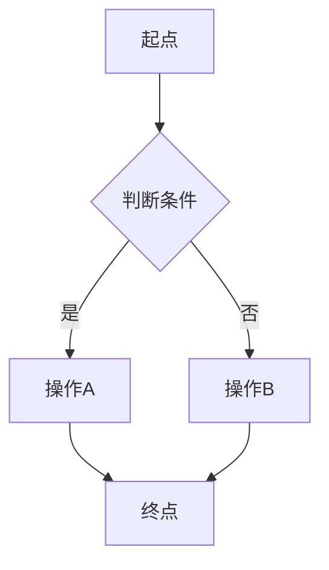
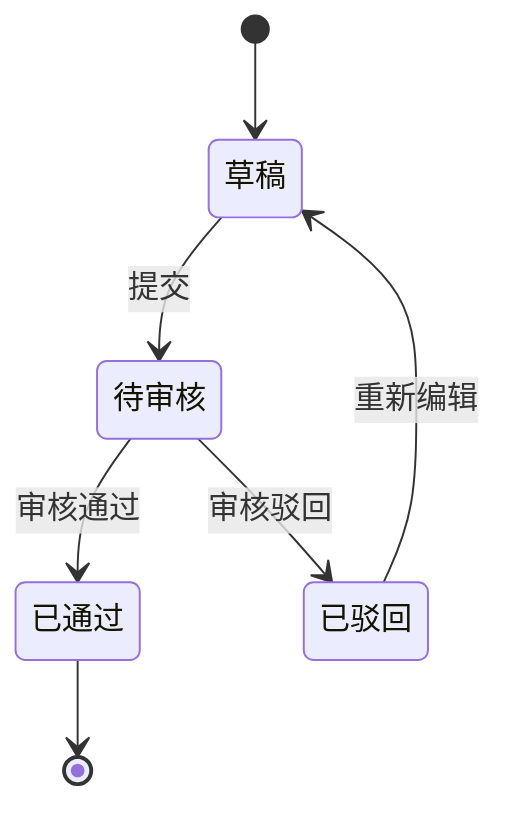

# PRD 完整模板

本文件是 SPACE-prd-writer 的参考模板。生成 PRD 时按此结构输出，每个章节的说明文字是写作指引（不要原样复制到最终文档里），根据实际需求填充内容。

---

## 文档头部

```markdown
# [产品名称] 产品需求文档（PRD）

版本号：V1.0.0

| 版本   | 时间       | 修订人 | 备注             |
|--------|-----------|--------|-----------------|
| V1.0.0 | YYYY/MM/DD | xxx    | 创建 V1.0.0 版本 |
```

---

## 一、概述（为什么做）

### 1.1 产品概述及目标

#### 1.1.1 背景介绍
说明产品/功能诞生的背景：市场环境、用户痛点、业务诉求、竞品动态等。写清楚"为什么现在要做这件事"。

#### 1.1.2 产品概述
用 2-3 句话概括这个产品/功能是什么、做什么、给谁用。相当于电梯演讲。

#### 1.1.3 产品目标

**业务目标**
具体的、可量化的业务指标。

| 目标 | 指标 | 目标值 | 达成时间 |
|------|------|--------|---------|
| 例：提升转化率 | 注册→下单转化率 | 从 5% 提升至 8% | 上线后 3 个月 |

**用户目标**
从用户视角描述他们能获得什么。

| 目标用户 | 用户目标 | 衡量指标 |
|---------|---------|---------|
| 例：普通消费者 | 更快找到想要的商品 | 搜索到下单平均时长 < 3 分钟 |

#### 1.1.4 目标用户
列出所有会使用本系统的用户角色及其特征。

| 角色 | 描述 | 核心诉求 |
|------|------|---------|
| 例：管理员 | 负责系统配置和用户管理 | 快速完成批量操作 |

### 1.2 名词说明

| 名词 | 说明 |
|------|------|
| 例：SKU | 最小库存管理单元 |

### 1.3 角色及权限

| 角色 | 权限范围 | 数据范围 |
|------|---------|---------|
| 例：超级管理员 | 全部功能 | 全部数据 |
| 例：普通用户 | 查看、编辑自己的数据 | 仅本人数据 |

### 1.4 文档阅读对象

| 对象 | 关注内容 |
|------|---------|
| 研发 | 功能需求、接口、数据字典 |
| UI/UX | 界面交互、全局规则 |
| 测试 | 异常流程、验收标准 |
| 运营 | 产品目标、埋点方案 |

---

## 二、产品描述（做什么）

### 2.1 产品需求描述
对整体需求的概括性描述，概括做什么、不做什么、约束条件。

### 2.2 产品整体流程

#### 2.2.1 主流程
用 Mermaid flowchart 绘制。



#### 2.2.2 子流程
对主流程中复杂节点展开为子流程图。

#### 2.2.3 数据流图（DFD）
图形化表示系统中数据的流动、处理过程、数据存储以及系统与外部实体的交互。包含四个核心元素：
- 外部实体（数据源/数据宿）
- 处理过程
- 数据存储
- 数据流

#### 2.2.4 状态转换图（STD）
展示系统中关键对象（如订单、审批单）的状态流转。



### 2.3 全局说明

#### 2.3.1 全局异常处理

| 异常场景 | 处理方式 | 提示文案 |
|---------|---------|---------|
| 网络异常 | 显示提示，支持重试 | "请检查网络连接" |
| 服务超时 | 显示提示，支持重试 | "系统响应超时，请稍后重试" |
| 权限异常 | 显示提示，不允许操作 | "无操作权限" |
| 系统异常 | 显示提示，记录日志 | "系统开小差啦，请联系管理员" |
| 数据异常 | 显示提示 | "数据异常或不存在" |

#### 2.3.2 普通列表规则

| 规则项 | 说明 |
|--------|------|
| 分页 | 默认 20 条/页，可调整为 10/50/100 |
| 排序 | 默认按创建时间倒序，支持点击表头排序 |
| 搜索 | 支持模糊搜索、多条件筛选 |
| 空数据 | 显示插画 + "暂无数据" |
| 统计 | 列表顶部展示统计信息 |
| 导出 | 支持 Excel 导出 |
| 批量操作 | 需二次确认 |

#### 2.3.3 全局交互

| 场景 | 交互方式 |
|------|---------|
| 操作成功 | Toast 提示"操作成功"，自动消失 |
| 操作失败 | 弹窗提示错误详情 |
| 加载中 | 显示全局 loading 动画 |
| 表单保存 | 自动返回上一页并提示 |
| 删除操作 | 二次确认弹窗 |
| 异步操作 | 按钮置灰防止重复提交 |
| 空状态 | 显示插画 + 文字提示 |

### 2.4 产品版本规划（里程碑）

| 版本 | 范围 | 计划时间 | 状态 |
|------|------|---------|------|
| V1.0 | 核心功能（MVP） | YYYY/MM | 进行中 |
| V1.1 | 增强功能 | YYYY/MM | 规划中 |
| V2.0 | 全量功能 | YYYY/MM | 远期 |

### 2.5 产品框架
描述产品的整体结构、模块划分、模块间关系。可使用架构图。

### 2.6 功能清单

| 模块 | 功能 | 优先级 | 版本 | 说明 |
|------|------|--------|------|------|
| 用户管理 | 注册登录 | P0 | V1.0 | 支持手机号+验证码 |
| 用户管理 | 个人信息 | P1 | V1.0 | 头像、昵称、手机号 |

---

## 三、功能需求（怎么做）

每个功能模块按以下结构书写。如有子功能，递归使用同样的结构。

### 3.x [功能模块名]

#### 3.x.1 描述
一句话描述这个功能做什么。

#### 3.x.2 用户故事
```
作为 [角色]，我希望 [操作]，以便 [目的]。
```
可以有多条用户故事。

#### 3.x.3 前置条件
使用该功能需要满足的前提条件。

| 类型 | 条件 |
|------|------|
| 数据依赖 | 例：用户已完成实名认证 |
| 权限依赖 | 例：需要管理员角色 |
| 功能依赖 | 例：需先完成 3.1 用户注册 |

#### 3.x.4 后置条件
执行该功能后，系统状态发生的变化。
- 例：列表数据更新
- 例：触发通知给相关人员

#### 3.x.5 界面及交互
描述页面布局、控件说明、操作反馈。如有原型图请引用。

| 元素 | 类型 | 必填 | 默认值 | 校验规则 | 操作反馈 |
|------|------|------|--------|---------|---------|
| 名称 | 文本输入框 | 是 | - | 1-50字符，不含特殊字符 | 超长时提示 |
| 类型 | 下拉选择 | 是 | 请选择 | - | - |

#### 3.x.6 业务流程
用 Mermaid 绘制该功能的业务流程。

#### 3.x.7 异常/分支流程

| 场景 | 触发条件 | 处理方式 | 提示文案 |
|------|---------|---------|---------|
| 重复提交 | 用户连续点击提交 | 首次点击后按钮置灰 | - |
| 数据不存在 | 查询ID无对应数据 | 返回空状态页 | "内容不存在或已删除" |

#### 3.x.8 数据字典

| 字段名 | 类型 | 必填 | 说明 | 示例值 |
|--------|------|------|------|--------|
| id | Long | 是 | 主键 | 1001 |
| name | String(50) | 是 | 名称 | "测试项目" |
| status | Enum | 是 | 状态：0-草稿 1-生效 | 1 |
| created_at | DateTime | 是 | 创建时间 | 2025-01-01 12:00:00 |

#### 3.x.9 子功能
如有子功能，递归使用 3.x.1 - 3.x.8 的结构。

---

## 四、非功能需求（注意事项）

### 4.1 安全与合规需求

| 需求 | 说明 |
|------|------|
| 数据加密 | 敏感字段（密码、手机号）加密存储 |
| 传输安全 | 全站 HTTPS |
| 权限控制 | 基于 RBAC 模型 |
| 合规要求 | 符合《个人信息保护法》等相关法规 |

### 4.2 统计需求（埋点）

| 事件名 | 触发时机 | 属性 | 说明 |
|--------|---------|------|------|
| page_view | 页面加载完成 | page_name, user_id | 页面访问统计 |
| button_click | 按钮点击 | button_name, page_name | 操作行为统计 |
| form_submit | 表单提交成功 | form_name, duration | 表单完成率统计 |
| error_occur | 异常发生 | error_code, error_msg | 异常监控 |

### 4.3 性能需求

| 指标 | 要求 |
|------|------|
| 页面加载时间 | 首屏 < 2s（3G 网络） |
| 接口响应时间 | P99 < 500ms |
| 并发支持 | 支持 xxx 并发用户 |
| 可用性 | 99.9% |

> 如遵循公司统一性能规范，注明"遵循公司《通用系统性能规范》"即可。

### 4.4 数据库设计
描述核心表结构、索引策略、数据生命周期管理。如暂不确定，标注 [待确认] 并注明需要 DBA 参与评审。

### 4.5 系统集成

| 对接系统 | 接口方向 | 协议 | 说明 |
|---------|---------|------|------|
| 例：用户中心 | 调用 | HTTP REST | 获取用户信息 |
| 例：消息中心 | 推送 | MQ | 发送通知 |

---

## 五、附录（补充文档）

### 5.1 验收标准与测试要点

| 功能 | 验收条件 | 优先级 |
|------|---------|--------|
| 例：用户注册 | 输入合法手机号+验证码，注册成功后跳转首页 | P0 |
| 例：用户注册 | 输入已注册手机号，提示"该手机号已注册" | P0 |
| 例：用户注册 | 验证码过期后提交，提示"验证码已过期" | P1 |
